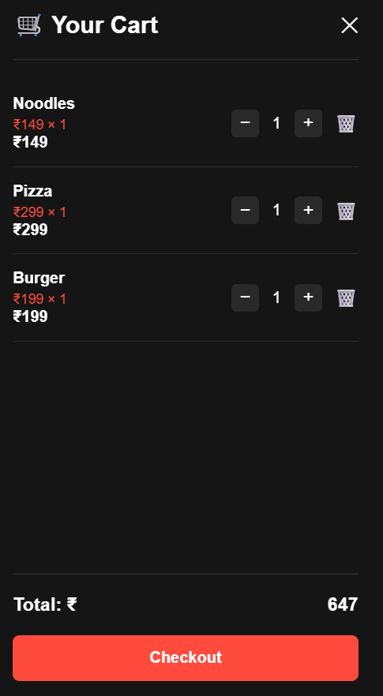
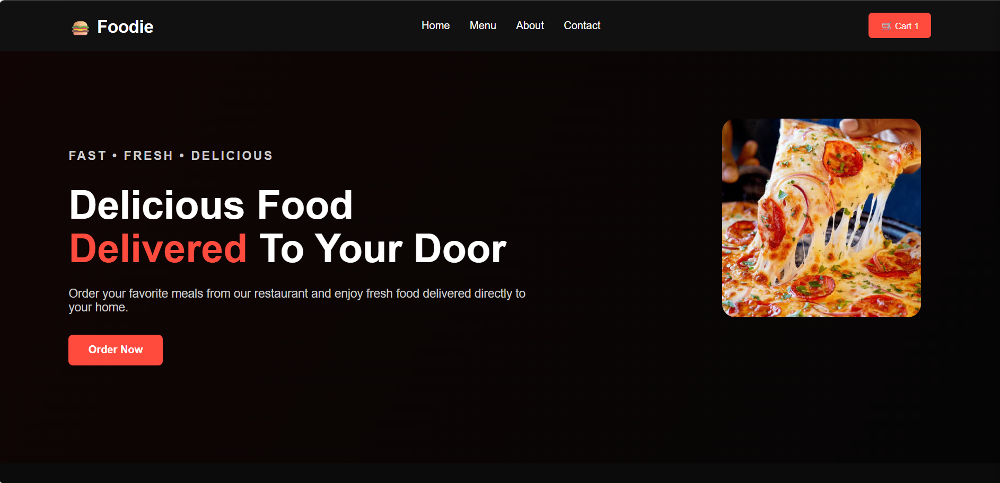
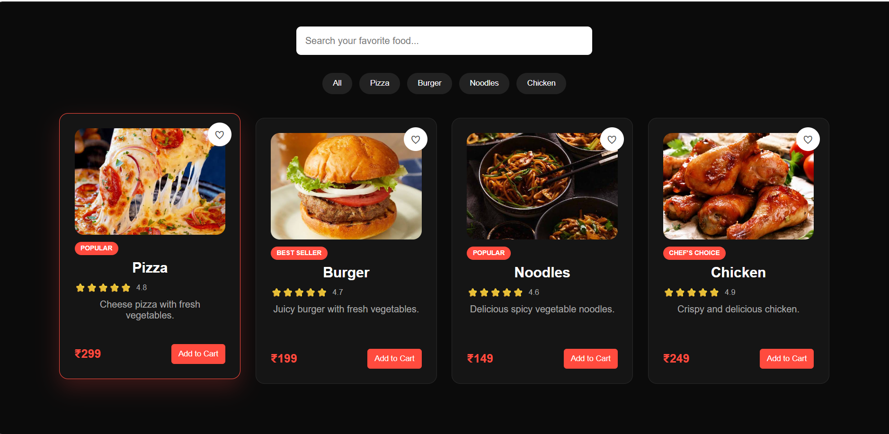
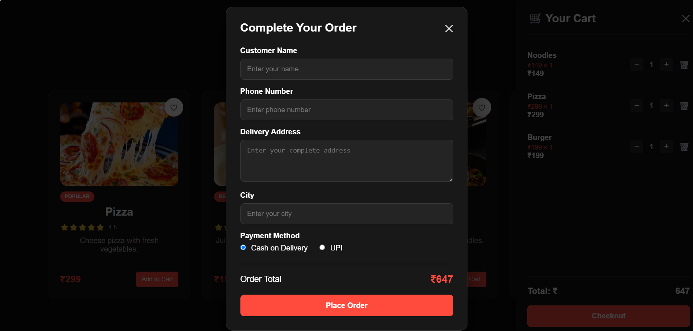

# 🍔 Foodie — Online Food Ordering Website

A responsive and interactive online food ordering website built using **HTML, CSS, and JavaScript**.

🌐 **Live Demo:** https://sanjay79855.github.io/food-order-website/

---

## 📌 About the Project

**Foodie** is a modern food-ordering website that allows users to browse food items, search and filter the menu, add products to a shopping cart, manage quantities, and place an order through a checkout form.

The project was created to practice and demonstrate front-end web development concepts including **HTML structure, CSS styling, JavaScript DOM manipulation, event handling, and localStorage**.

---

## ✨ Features

* 🏠 Responsive home page
* 🍕 Food menu with multiple categories
* 🔎 Food search functionality
* 🏷️ Category filtering
* 🛒 Add to Cart functionality
* ➕ Increase item quantity
* ➖ Decrease item quantity
* 🗑️ Remove items from cart
* 💾 Cart data stored using Local Storage
* 💰 Automatic cart total calculation
* 📦 Checkout form
* 💵 Cash on Delivery option
* 💳 UPI payment option
* 📱 Responsive design
* 🎨 Modern dark-themed UI

---

## 🛠️ Technologies Used

* **HTML5** — Website structure
* **CSS3** — Styling, layout and responsive design
* **JavaScript** — Interactivity and cart functionality
* **LocalStorage** — Persistent cart data
* **GitHub Pages** — Website deployment

---

## 🍽️ Available Food Items

| Food       | Price |
| ---------- | ----: |
| 🍕 Pizza   |  ₹299 |
| 🍔 Burger  |  ₹199 |
| 🍜 Noodles |  ₹149 |
| 🍗 Chicken |  ₹249 |

---

## 🛒 Cart Functionality

The shopping cart allows users to:

1. Add food items to the cart
2. Increase or decrease quantity
3. Remove items
4. Automatically calculate item totals
5. Automatically calculate the complete order total
6. Store cart data in browser LocalStorage

---

## 📂 Project Structure

```text
food-order-website/
│
├── index.html
├── style.css
├── script.js
├── images/
│   ├── pizza.jpg
│   ├── burger.jpg
│   ├── noodles.jpg
│   └── chicken.jpg
│
└── README.md
```

---

## 🚀 How to Run Locally

### 1. Clone the repository

```bash
git clone https://github.com/Sanjay79855/food-order-website.git
```

### 2. Open the project

Open the project folder in **Visual Studio Code**.

### 3. Run the website

Open `index.html` using **Live Server** or directly in your browser.

---

## 🌐 Live Demo

Visit the deployed website:

https://sanjay79855.github.io/food-order-website/

---

## 📸 Screenshots

## 📸 Screenshots
### 🛒 Shopping Cart

### 🏠 Home Page


### 🍕 Food Menu


### 📦 Checkout

---

## 🔮 Future Improvements

* 🔐 User login and registration
* 🗄️ Backend database integration
* 💳 Real online payment integration
* 📦 Order tracking system
* 👤 User profile
* ⭐ Customer reviews and ratings
* 📊 Admin dashboard
* 📱 Mobile app version

---

## 🎯 Learning Outcomes

Through this project, I practiced:

* HTML5 semantic structure
* CSS Flexbox and Grid
* Responsive web design
* JavaScript functions
* DOM manipulation
* Event handling
* Array methods
* LocalStorage
* Form handling
* Git and GitHub
* GitHub Pages deployment

---

## 👨‍💻 Author

**Sanjay Singh**

🎓 B.Tech Computer Science Engineering — Data Science

🔗 GitHub: https://github.com/Sanjay79855

🔗 LinkedIn: https://www.linkedin.com/in/sanjay-singh-584098315

---

## ⭐ Show Your Support

If you like this project, consider giving it a ⭐ on GitHub!

---

### 📄 License

This project is created for learning and portfolio purposes.
